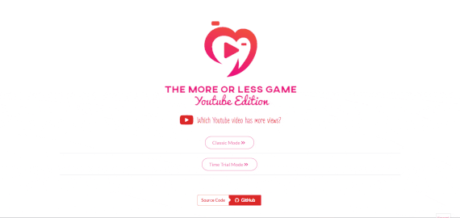

# Higher Lower Game - Youtube Edition

If you've ever played the Higher Lower game, then you know what this is. This web app is the same thing - but for Youtube videos. It's quite a bit of fun to play, and I could not find any variant online for Youtube videos, so I decided to build one myself.

## Try It Out

You can try it out here at: https://www.moreorlessyoutube.com

If you would like to try it out locally,

Clone the repo: `https://github.com/kmzaw611/More-Or-Less-Youtube`

Use either npm or Docker afterwards.

`npm install`\
`npm start`

### or

`docker build -t moreorless:latest .`\
`docker run --name moreorless -d -p 3000:3000 moreorless:latest`

Then go to your browser at https://localhost:3000.

## Implementation

React with Semantic UI was used to develop the frontend. A serverless solution with Firebase was implemented to store and retrieve Youtube videos from a database.

A large amount of Youtube videos were scraped and stored in the Firestore database using a method I developed. Please see src/scraper/Scraper.js for a detailed explanation on how it works.
